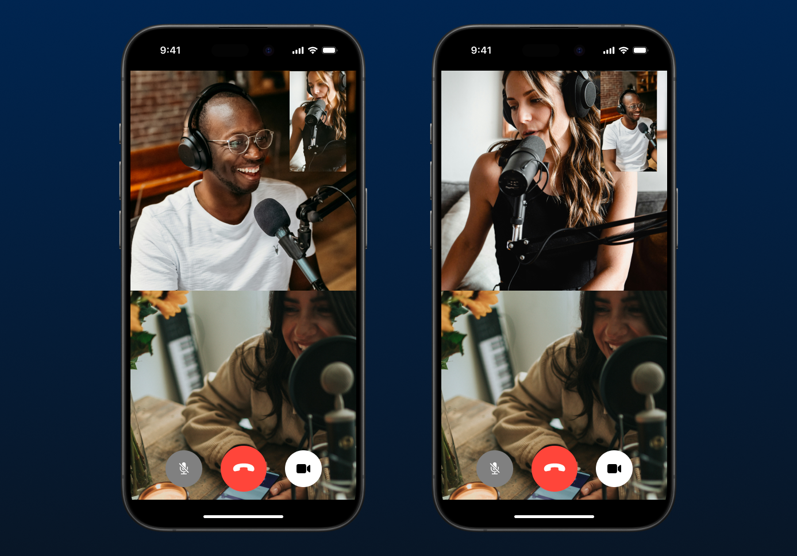

# Chapter 1: Basic setup



## Intro

Agora's Video Calling allows you to add customized real-time video experiences to any application. ([Product overview](https://docs.agora.io/en/video-calling/overview/product-overview?platform=ios))

As shown in the image above, three users are on a video conferencing call. By following this chapter, you will be able to implement this sample app (without the control buttons at the bottom), using the Agora RTC iOS SDK. And we will provide some sample code that allows the sample app to display more remote video feeds when there are more users on the same call.

## Prerequisites

- Agora Console credentials: [Get started with Agora](https://www.agora.io/en/blog/how-to-get-started-with-agora?utm_source=medium&utm_medium=blog&utm_campaign=AGORA_IOS_GUIDE)
- An Apple Developer account (for running your app on physical devices): Head to [developer.apple.com](https://developer.apple.com) to register a free account if you don't have one yet

> If you're following the `Get started with Agora` guide, you can skip Step 3, as we will use Swift Package Manager (SPM) to import the SDK later in this chapter.

## Project Setup

### Create a new Xcode project
Firstly, let's go to Xcode and create a new project, using the iOS App template. In order to test on physical devices, make sure to add your Apple Developer team. For now, we select Storyboard for user interface and use Swift as the language.


We need to explain our usage of the protected resources (in this case, camera and microphone) in `Info.plist`. Create two entries with these following keys:
- Privacy - Microphone Usage Description
- Privacy - Camera Usage Description

For the Value fields, you can use these examples or come up with your own words:
- "For the purpose of using the microphone. For example, for a call or live interactive streaming session."
- "For the purpose of using the camera. For example, for a call or live interactive streaming session."

### Import AgoraRtcKit

In order to make this app with minimal effort, we can simply use the Agora Video SDK. There are multiple options for you to import the SDK, but in this guide, we will use Swift Package Manager (SPM).

Go to Xcode's Project Navigator and select the project file. Navigate to project setting and select Package Dependencies tab at the top. Then click the `+` button.


Paste the following URL in the textfield on the top right corner of the window and then click "Add Package".
```
https://github.com/AgoraIO/AgoraRtcEngine_iOS.git
```


After fetching the remote git repository, Xcode shows a list of package products for us to use. Look for "RtcBasic", open the drop-down menu and select your app target. Then click "Add Package". Now you can use Agora SDK within your project.

## Implement Video Call Views and Agora RTC

Navigate to `ViewController.swift`. We'll demonstrate how to initalize Agora RTC engine, add individual subviews, join/leave a channel and display both local and remote video feeds. Firstly, make sure you import the SDK properly at top of the file:

```Swift
import AgoraRtcKit
```

### Initialize Agora RTC Engine

During the entire lifecycle of our view controller, we need a reference to the shared `AgoraRtcEngineKit` object. Let's declare the stored property at top of our view controller code and initialize it in `viewDidLoad(_:)`

```Swift
class ViewController: UIViewController {
    private var agoraKit: AgoraRtcEngineKit!

    override func viewDidLoad() {
        super.viewDidLoad()

        let config = AgoraRtcEngineConfig()
        // Enter the app ID you obtained from Agora Console
        config.appId = <#Your app ID#>
        // Obtain and store reference of the shared engine, passing the config and `self` as delegate
        agoraKit = AgoraRtcEngineKit.sharedEngine(with: config, delegate: self)
    }
}
```

> Note: the project won't compile at this point as our view controller class hasn't conformed to the delegate protocol. We will cover this in the [Implement event delegate](#implement-event-delegate) section later.

### Add views that display video feeds

In order to display the video feeds (both local and remote), we need two subviews added to the view controller's `view`. One of them will be an instance of `UICollectionView` so we can display all remote video feeds. Later on we can utilize the Agora engine to render the video feeds in these views, without us worrying about implementing `AVFoundation` ourselves.

We will create a spearate subclass of `UICollectionViewController` so we can handle collection view-related logic in that separate file. Let's call it `VideoCollectionViewController`.

```Swift
class ViewController: UIViewController {
    // ...
    private var collectionViewController: VideoCollectionViewController!
    private let localView = UIView()
    private var collectionView: UIView!

    override func viewDidLoad() {
        super.viewDidLaod()

        // ... (existing Agora Engine setup code)

        // Add local view to the screen
        view.addSubview(localView)

        // Add collection view that holds remote videos
        collectionViewController = .init(agoraRTCEngine: agoraKit)
        collectionView = collectionViewController.view
        view.addSubview(collectionView)
        addChild(collectionViewController)
        collectionViewController.didMove(toParent: self)

        // Don't forget to add layout constraints, if you're not using Interface Builder.
        NSLayoutConstraint.activate([
            // Create constraints for the two views
        ])
    }
}
```

Feel free to write your own code to position/size the views, but remember:
- Local view is always above the collection view, as it should be floating on top.
- We recommend using 16:9 aspect ratio for the local view. You can simply achieve this by using `NSLayoutConstraint` with multiplier.
- The collection view should fill the entire screen.


As you can see, we're passing our `AgoraRtcEngineKit` instance to the intializer of `VideoCollectionViewController`. You can write your own implementation of the collection view controller, but remember:
- The collection view only has one section.
- Use 0 as the number of items in this section for now. We will discuss how we keep track of number of remote users later in this chapter.
- Simply return `UICollectionViewCell()` when you dequeue a reusable cell, for now. We will create our own cell type later.

Here is the sample code for our collection view controller:

```Swift
final class VideoCollectionViewController: UICollectionViewController {

    private let agoraRTCEngine: AgoraRtcEngineKit

    init(agoraRTCEngine: AgoraRtcEngineKit) {
        self.agoraRTCEngine = agoraRTCEngine
        super.init(collectionViewLayout: UICollectionViewFlowLayout())
    }

    @available(*, unavailable)
    required init?(coder: NSCoder) {
        // Required init not needed
        nil
    }
    
    override func viewDidLoad() {
        super.viewDidLoad()
        
        // Make sure content of this collection view isn't displayed in safe area.
        collectionView.contentInsetAdjustmentBehavior = .always
    }

    // TODO: Implement these methods later. uid is used to identify individual remote users.
    func addRemoteVideo(with uid: UInt) {}
    func removeRemoteVideo(with uid: UInt) {}
}
```

### Display local video feed

Since we already have access to our local camera feed, we can simply start rendering it right away when our view controller is ready. Call `setupLocalVideo()` shown below in your `viewDidLoad(_:)` method:

```Swift
func setupLocalVideo() {
    // Enable video module
    agoraKit.enableVideo()
    // Start local preview
    agoraKit.startPreview()
    let videoCanvas = AgoraRtcVideoCanvas()
    videoCanvas.uid = 0
    videoCanvas.renderMode = .hidden
    videoCanvas.view = localView
    // Set local view
    agoraKit.setupLocalVideo(videoCanvas)
}
```

### Implement event delegate

We need to implement `AgoraRtcEngineDelegate` so we can perform actions when certain events happen, eg. when we successfully join a channel or someone else joins the channel. See [documentation](https://api-ref.agora.io/en/voice-sdk/ios/4.x/documentation/agorartckit/agorartcenginedelegate) for all delegate methods you can potentially implement.

In this chapter, we will be primarily implementing two delegate methods:

```Swift
extension ViewController: AgoraRtcEngineDelegate {
    
    func rtcEngine(_ engine: AgoraRtcEngineKit, didJoinedOfUid uid: UInt, elapsed: Int) {
        // Occurs when a remote user or user joins the channel.
        collectionViewController.addRemoteVideo(with: uid)
    }

    func rtcEngine(_ engine: AgoraRtcEngineKit, didOfflineOfUid uid: UInt, reason: AgoraUserOfflineReason) {
        // Occurs when a remote user or host goes offline.
        collectionViewController.removeRemoteVideo(with: uid)
    }
}
```

### Display remote video feeds

Similar to displaying local video feed, we'll make use of `AgoraRtcVideoCanvas` in our `VideoCollectionViewController`. But firstly, we need to create our own custom collection view cell, `VideoCallCollectionItemCell`:

```Swift
import AgoraKit
import UIKit

final class VideoCallCollectionItemCell: UICollectionViewCell {
    
    func configure(with uid: UInt, agoraRTCEngine: AgoraRtcEngineKit) {
        
        let videoCanvas = AgoraRtcVideoCanvas()
        videoCanvas.uid = uid
        videoCanvas.renderMode = .hidden
        videoCanvas.view = self
        agoraRTCEngine.setupRemoteVideo(videoCanvas)
    }
}
```

After this, we can register this cell type in our collection view controller and configure the cell content when dequeuing a reusable cell. 

To make collection view diffing easier, we can make use of `UICollectionViewDiffableDataSource`. In this case we don't need to keep a track of `uid`s as the diffable data source will manage it automatically for us. The only thing we need to do is updating the diffable data source when a remote user is added/removed from the call.

You can learn more about [Updating Collection Views Using Diffable Data Sources on developer.apple.com](https://developer.apple.com/documentation/uikit/views_and_controls/collection_views/updating_collection_views_using_diffable_data_sources). Expand the following section to reveal the full implementation of `VideoCallCollectionViewController`:

<details>
    <summary>Collection View sample code</summary>
    
```Swift
import AgoraRtcKit

final class VideoCollectionViewController: UICollectionViewController {
    
    // Define Hashable item type
    struct Item: Hashable {
        let uid: UInt
    }
    
    private let agoraRTCEngine: AgoraRtcEngineKit
    private lazy var dataSource = makeDataSource()
    
    init(agoraRTCEngine: AgoraRtcEngineKit) {
        self.agoraRTCEngine = agoraRTCEngine
        // Use FlowLayout so we have control of the collection view layout via delegate
        super.init(collectionViewLayout: UICollectionViewFlowLayout())
    }
    
    @available(*, unavailable)
    required init?(coder: NSCoder) {
        // Required init not needed
        nil
    }
    
    override func viewDidLoad() {
        super.viewDidLoad()
        
        // Make sure cells won't be displayed within safe area
        collectionView.contentInsetAdjustmentBehavior = .always

        // Register reusable cell and set data source
        collectionView.register(VideoCallCollectionItemCell.self, forCellWithReuseIdentifier: "reuse-id")
        collectionView.dataSource = dataSource
        
        // Initialize data source to contain 1 empty section
        var snapshot = dataSource.snapshot()
        snapshot.appendSections([.main])
        dataSource.apply(snapshot)
    }
    
    func addRemoteVideo(with uid: UInt) {
        // When any remote user joins the call
        let newItem = Item(uid: uid)
        var snapshot = dataSource.snapshot()
        snapshot.appendItems([newItem], toSection: .main)
        dataSource.apply(snapshot)
    }
    
    func removeRemoteVideo(with uid: UInt) {
        // When any remote user leaves the call
        let newItem = Item(uid: uid)
        var snapshot = dataSource.snapshot()
        snapshot.deleteItems([newItem])
        dataSource.apply(snapshot)
    }
}

// MARK: - Data Source
private extension VideoCollectionViewController {
    
    // Define Hashable section types
    enum Section: Hashable {
        case main
    }
    
    func makeDataSource() -> UICollectionViewDiffableDataSource<Section, Item> {
        .init(collectionView: collectionView) { [weak self] collectionView, indexPath, item in
            guard let self,
                  let cell = collectionView.dequeueReusableCell(withReuseIdentifier: "reuse-id", for: indexPath) as? VideoCallCollectionItemCell
            else {
                assertionFailure("Dequeued reusable cell isn't VideoCallCollectionItemCell.")
                return UICollectionViewCell()
            }
            
            // Configure cell to render remote video
            cell.configure(with: item.uid, agoraRTCEngine: agoraRTCEngine)
            return cell
        }
    }
}

// MARK: - Layout
extension VideoCollectionViewController: UICollectionViewDelegateFlowLayout {
    
    func collectionView(_ collectionView: UICollectionView, layout collectionViewLayout: UICollectionViewLayout, sizeForItemAt indexPath: IndexPath) -> CGSize {

        let snapshot = dataSource.snapshot()
        
        let safeAreaVSum = collectionView.safeAreaInsets.top + collectionView.safeAreaInsets.bottom
        let width = collectionView.frame.width
        let height = collectionView.frame.height - safeAreaVSum
        
        // Return different cell sizes based on number of items:
        // - Full screen if only 1 item
        // - 2: side-by-side vertically
        // - 3-4: 25% of screen space
        // - 5+: each item takes 1/3 of screen space (scrollable vertically if 9+)
        switch snapshot.numberOfItems(inSection: .main) {
        case 1:
            return CGSize(width: width, height: height)
        case 2:
            return CGSize(width: width, height: height / 2)
        case 3...4:
            return CGSize(width: width / 2, height: height / 2)
        case 5...:
            return CGSize(width: width / 3, height: height / 3)
        default:
            return .zero
        }
    }
    
    // Remove gap between items
    func collectionView(_ collectionView: UICollectionView, layout collectionViewLayout: UICollectionViewLayout, minimumLineSpacingForSectionAt section: Int) -> CGFloat {
        0
    }
    
    func collectionView(_ collectionView: UICollectionView, layout collectionViewLayout: UICollectionViewLayout, minimumInteritemSpacingForSectionAt section: Int) -> CGFloat {
        0
    }
}

```
</details>

### Join a channel and publish audio and video streams

The last step in this chapter is to actually join our channel. Once you have set up everything above in `viewDidLoad(_:)`, call `joinChannel()` shown below:

```Swift
func joinChannel() {

    let option = AgoraRtcChannelMediaOptions()
    // In the video call scenario, set the channel scenario to communication
    option.channelProfile = .communication
    // Set the user role as host
    option.clientRoleType = .broadcaster
    // Use a temporary token to join the channel
    // Pass in your project's token and channel name here.
    agoraKit.joinChannel(
        byToken: "<#Your Token#>",
        channelId: "<#Your Channel ID#>",
        uid: 0, // Use 0 to get automatically assigned a unique uid.
        mediaOptions: option
    )
}
```

Now, we can connect one or many iOS devices and run the app. Remember to select a developer team in Signing & Capabilities panel in project settings.

## Testing if your sample app is working as expected

With the sample app loaded onto your physical device, we can use [Agora Web Demo](https://webdemo-global.agora.io) to simulate remote users joining the call. Enter your App ID and App Certificate to the Initialize Settings page, and head over to the Basic Video Calling page. Follow steps 1-3 to join the call from your web browser.

You can create multiple browser tabs to act as separate users. Then verify if all the web users are being displayed on your Apple device.

## Conclusion

That's it. We've achieved our very basic goal - allowing a number of users to communicate with each other in real-time. In the next few chapters, we'll cover how to add buttons that control local and remote feeds, including muting, switching camera, and hanging up.

Check out branch `chapter-1-project` for the completed Xcode project.

---
