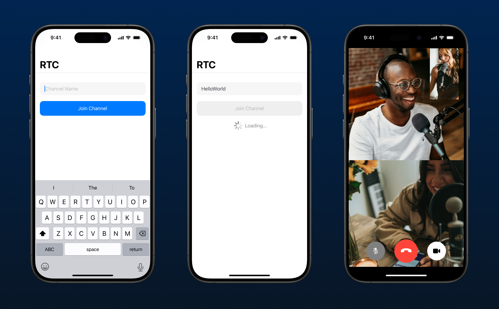

# Chapter 2: Obtain RTC tokens from a local token server

In the [last chapter](../1-basic-set-up/README.md), we successfully created a very simple app that allows two users to join a video call. To keep our sessions secure, we generated a temporary token on [Agora Console](https://console.agora.io) for the app to use. However, our temporary token is only valid for 24 hours and it cannot be used in production environments. In this chapter you will learn how to create your own token server (locally, for now) and generate tokens on demand.

For our sample app, we would like to allow users to join a channel that is defined by themselves. We want to show the activity indicator when we're retrieving a token and navigate to the video call screen we created in the last chapter:



## Prerequisites

1. Clone [Agora Token Service](https://github.com/AgoraIO-Community/agora-token-service?tab=readme-ov-file) repository to your computer
2. Install [Go language](https://go.dev/dl/)


## Setting up Agora token service locally

### Configuring and starting Agora token service

Firstly, we need to configure environment variables with our App ID and App Certificate obtained from Agora Console. We can duplicate, rename, and edit the `.env.example` file located in the cloned repository:

```console
$ cd /path/to/agora-token-service/repo
$ cp .env.example .env
$ vi .env
```

Enter your App ID and Certificate. Use `*` as the value for `CORS_ALLOW_ORIGIN` for now. Run using the following command:

```console
go run cmd/main.go
```

Verify the service is up and running successfully in a different terminal session. You should get a valid response `{"message":"pong"}`:
```console
curl localhost:8080/ping
```

### `/getToken` endpoint

To generate an RTC token for video conferencing, we need to make a POST request to the `/getToken` endpoint, including the following parameters in the request body:

```json
{
    "tokenType": "rtc",
    "channel": "channel-name", // Replace this with actual channel name
    "role": "publisher",
    "uid": "0",
    "expire": 3600 // optional: expiration time in seconds (default: 3600)
}
```

We can manually verify if this endpoint is up and running in console:

```console
curl -X POST -H "Content-Type: application/json" -d '{
    "tokenType": "rtc",
    "channel": "test-channel",
    "role": "publisher",
    "uid": "0",
    "expire": 60
}' "localhost:8080/getToken"
```

A successful response will contain the only field with key `token`.

## Building token service in sample app

### Sending `/getToken` requests from our sample app

Open the Awesome Video Call Xcode project. If you skipped Chapter 1, you can get the completed project by checking out the `chapter-1-project` branch of this repo.

Create a new Swift file writing your own method to send a POST request, with the above request body to `localhost:8080/getToken` to get your new token. Alternatively, use the sample code below:

<details>
    <summary>Sample code</summary>

Let's create a service that helps us obtain the token. In Xcode, select `File > New...`, select Swift File and enter `AgoraTokenService` as file name. 

We'll create two `Codable` objects representing the request and response bodies respectively:

```Swift
struct AgoraGetTokenRequestBody: Codable {
    
    let tokenType: String
    let channel: String
    let role: String
    let uid: String
    let expire: Int
    
    init(
        tokenType: String = "rtc",
        channel: String,
        role: String = "publisher",
        uid: Int = 0,
        expire: Int = 3600
    ) {
        self.tokenType = tokenType
        self.channel = channel
        self.role = role
        self.uid = "\(uid)"
        self.expire = expire
    }
}

struct AgoraGetTokenResponse: Codable {
    let token: String
}
```
And finally, we can write `AgoraTokenService` with our async function retrieving tokens:

```Swift
final class AgoraTokenService {
    
    func getToken(for channelName: String) async throws -> String {
        
        let requestBody = AgoraGetTokenRequestBody(channel: channelName)
        let requestBodyData = try JSONEncoder().encode(requestBody)
        
        var urlRequest = URLRequest(url: URL(string: "http://localhost:8080/getToken")!)
        urlRequest.httpMethod = "POST"
        urlRequest.httpBody = requestBodyData
        let (data, _) = try await URLSession.shared.data(for: urlRequest)
        return try JSONDecoder().decode(AgoraGetTokenResponse.self, from: data).token
    }
}
```

</details>

## Building views that allow user inputs

### Changes to existing code
Let's first refactor our existing `ViewController` to `VideoCallViewController`. You can do so by right-clicking the class name in the code editor and select `Refactor > Rename...`. 

We also need to make sure this view controller has access to the channel name user entered, and the token obtained from our local token server. Let's add two private properties in `VideoCallViewController` and an initializer that sets the properties:

```Swift
final class VideoCallViewController: UIViewController {

    // Existing properties
    // ...

    private let token: String
    private let channel: String

    init(token: String, channel: String) {
        self.token = token
        self.channel = channel
        super.init(nibName: nil, bundle: nil)
    }

    @available(*, unavailable)
    required init?(coder: NSCoder) {
        // Required init not needed
        nil
    }

    // Existing code
    // ...
}
```

### User input and loading page

Create a spearate view controller `JoinChannelViewController` that allows users to enter their preferred channel name, with a join button. When the join button is tapped, you should validate the user input (non-empty) then request a token from our local server using `AgoraTokenService` we created earlier.

Once we have a valid token, we'll launch our video call screen and join the given channel using this token, by using the new intializer we just created above, `VideoCallViewController.init(token:channel:)`.

Feel free to write your own UI code for `JoinChannelViewController`. Alternatively, you can check out the sample code below:

<details>
    <summary>Sample code</summary>

Let's create a new `UIViewController` subclass called `JoinChannelViewController`:

```Swift
final class JoinChannelViewController: UIViewController {
    
    private let textField = UITextField()
    private let joinButton = UIButton()
    private let loadingStack = UIStackView()
    private let activityIndicator = UIActivityIndicatorView(style: .medium)
    private let loadingLabel = UILabel()

    override func viewDidLoad() {
        super.viewDidLoad()

        title = "RTC"
        view.backgroundColor = .systemBackground
        
        // TODO: Your own code setting up and laying out subviews
        // (Or see completed sample project)
    }
}

private extension JoinChannelViewController {
    
    /// Obtain a new token from `AgoraTokenService`
    @objc
    func joinButtonTapped(_ button: UIButton) {

        guard let channelName = textField.text,
              !channelName.isEmpty
        else {
            return
        }
                
        let tokenService = AgoraTokenService()
        Task {
            do {
                // Call async function
                let token = try await tokenService.getToken(for: channelName)
                
                // Create VideoCallViewController with new token
                let videoCallViewController = VideoCallViewController(
                    token: token,
                    channel: channelName
                )
                
                // Push VideoCallViewController
                DispatchQueue.main.async { [weak self] in
                    self?.navigationController?.pushViewController(
                        videoCallViewController,
                        animated: true
                    )
                }
                
            } catch {
                assertionFailure("Token service error: \(error.localizedDescription)")
            }
        }
    }
}
```

</details>

### Presenting view controllers programmatically

From this point, we will programmatically present all screens, instead of using a storyboard. Head to `SceneDelegate.swift` and replace `scene(_:willConnectTo:options:)` with the following code:

```Swift
func scene(_ scene: UIScene, willConnectTo session: UISceneSession, options connectionOptions: UIScene.ConnectionOptions) {
    guard let windowScene = (scene as? UIWindowScene) else { return }
    let window = UIWindow(windowScene: windowScene)
    let joinChannelViewController = JoinChannelViewController()
    window.rootViewController = UINavigationController(rootViewController: joinChannelViewController)
    self.window = window
    window.makeKeyAndVisible()
}
```

## Testing if your sample app is working as expected

Run the sample app on the simulator. Enter a channel name then tap the "Join" button. If everything is set up correctly, the sample app should navigate to the video call view.

If you want to test it on physical devices, you can change the request URL in `AgoraTokenService` to your Mac's IP address. Make sure your local network allows devices to communicate with each other (some workplace networks will not allow this).

Don't forget you can use [Agora Web Demo](https://webdemo-global.agora.io) to simulate remote users joining the call. Enter your App ID and App Certificate to the Initialize Settings page, and head over to the Basic Video Calling page. Follow steps 1-3 to join the call from your web browser.

## Conclusion

At this point, we no longer need to rely on the temporary token generated by Agora Console. Follow this guide for more features to be added in our sample app.

Check out branch `chapter-2-project` for the completed Xcode project.

---
