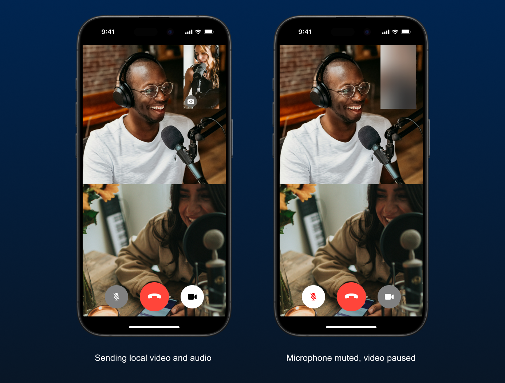

# Chapter 3: Add video call control buttons



In previous chapters, we covered how to create a very simple video calling app with Agora RTC. However, our app is missing a few basic features, such as muting the microphone and pausing the camera. With the Agora SDK, it is rather simple and straightforward to implement these missing features. Let's dive in.

## Prerequisites

At this point you should have completed [Chapter 2](../2-setup-token-server/README.md) with a completed sample project (check out branch `chapter-2-project` if you haven't had one). Also make sure that your local token server is running so we can join channels from your physical test devices.

## Implementing mute, pause and leave functions

In `VideoCallViewController`, we have already created the `joinChannel()` method that passes token and channel name to Agora engine. Let's create a few more methods that interact with the Aogra engine:

### Leave channel

```Swift
func leaveChannel() {
    agoraKit?.stopPreview()
    agoraKit?.leaveChannel()
    AgoraRtcEngineKit.destroy()
}
```

### Mute

```Swift
func toggleLocalAudioStreamMute(_ isMuted: Bool) {
    agoraKit.muteLocalAudioStream(isMuted)
}
```

### Pause

```Swift
func toggleLocalVideoStreamPause(_ isPaused: Bool) {
    agoraKit.muteLocalVideoStream(isPaused)
    agoraKit.enableLocalVideo(!isPaused)
}
```

## Building the UI

As shown in the image on top of this chapter, we have three buttons at the bottom of the screen to allow users to leave, mute, or pause. For the mute and pause buttons, we can use the `isSelected` state to highlight whether mute/pause is currently active. 

However, when we call `muteLocalVideoStream(_:)`, the camera is paused but the video feed will look frozen. So it's generally a good practice to either hide it, or cover it with a symbol and/or a blur view.

In this guide, we'll simply use a blur view on top of the local video view when the camera is paused. Create a `UIVisualEffectView` with a blur effect and place it on top of our local video view, or use the sample code below:

<details>
<summary>Sample code</summary>

```Swift
final class VideoCallViewController: UIViewController {

    // ... existing properties

    private let localPauseView = UIVisualEffectView()

    override func viewDidLoad() {
        // ... existing code

        // Add local video pause view
        localPauseView.translatesAutoresizingMaskIntoConstraints = false
        localPauseView.effect = UIBlurEffect(style: .light)
        localPauseView.isHidden = true

        view.addSubview(localPauseView)

        let localPauseViewConstraints = [
            localPauseView.leadingAnchor.constraint(equalTo: localView.leadingAnchor),
            localPauseView.topAnchor.constraint(equalTo: localView.topAnchor),
            localView.trailingAnchor.constraint(equalTo: localPauseView.trailingAnchor),
            localView.bottomAnchor.constraint(equalTo: localPauseView.bottomAnchor)
        ]

        NSLayoutConstraint.activate(localPauseViewConstraints)
    }

    func toggleLocalVideoStreamPause(_ isPaused: Bool) {
        // ... existing code
        localPauseView.isHidden = !isPaused
    }
}
```

</details>

At this point, you can come up with your own button implementation. Or simply use the sample code in the completed project. Our sample code includes a separate view class so we don't have to configure every button inside our view controller. Check out branch `chapter-3-project` and take a look at `VideoCallControlButtonsView`.

## Testing if your sample app is working as expected

Start your local token server and run the sample app on a physical device. Enter a channel name then tap the "Join" button. 

Use another device, or [Agora Web Demo](https://webdemo-global.agora.io) to check if your buttons are functioning properly.

## Conclusion

We now have the control button to allow users to mute their microphone, pause their camera, or leave the channel. Follow this guide for more features to be added in our sample app.

Check out branch `chapter-3-project` for the completed Xcode project.