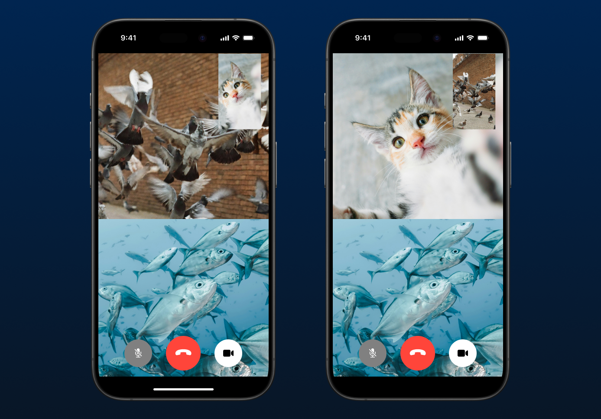

# "Awesome Video Call" Sample iOS App Guide

## Intro
In this series of step-by-step tutorials, we will learn how to build a simple iOS app with Agora SDK from scratch.

After reading each chapter, you can check out branch `chapter-X-project` (replace `X` with chapter number) for a sample project that contains everything covered in that chapter. You should be able to access the project located in the `src` folder.

## Prerequisites

- Agora Console credentials: [Get started with Agora](https://www.agora.io/en/blog/how-to-get-started-with-agora?utm_source=medium&utm_medium=blog&utm_campaign=AGORA_IOS_GUIDE)
- An Apple Developer account (for running your app on physical devices): Head to [developer.apple.com](https://developer.apple.com) to register a free account if you don't have one yet

> If you're following the `Get started with Agora` guide, you can skip Step 3, as we will use Swift Package Manager (SPM) to import the SDK in this guide.

## Chapters
1. [Basic setup](1-basic-set-up/README.md)
2. [Obtain RTC tokens from a local token server](2-setup-token-server/README.md)

---

[Click here for full Agora documentation](https://docs.agora.io/en/video-calling/overview/product-overview?platform=ios)